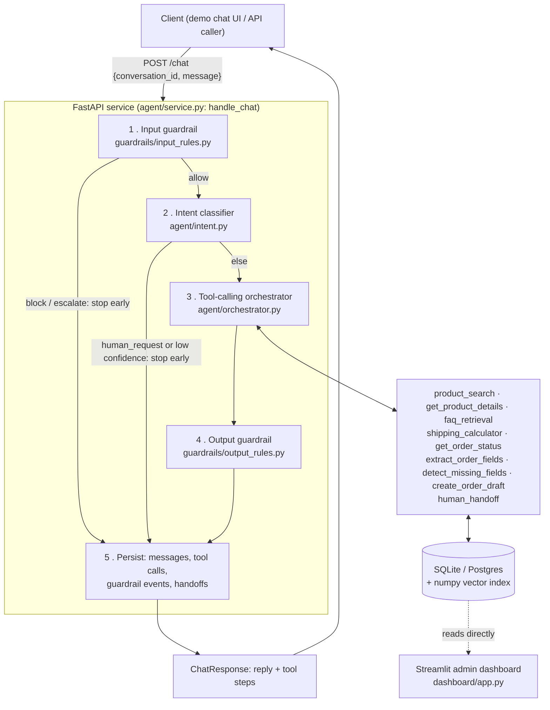

# Agentic E-commerce Support & Sales Copilot

An LLM-powered customer-support and sales **agent** (not a scripted chatbot) for a fictional
stationery store. It classifies intent, calls tools to search products and retrieve policy,
drafts orders while validating missing fields, blocks or escalates unsafe/out-of-policy input,
hands off to a human when it should, and measures all of that with a 6-metric evaluation suite
and an admin dashboard.

> ⚠️ **Synthetic-data & ethics notice.** This project uses **100% synthetic, fabricated
> data**. There is no real brand, customer, order, or personal data anywhere in this
> repository. The brand "Paperbloom" is invented for demonstration only, and the agent
> never charges a real payment method — orders only ever reach a `draft`/`confirmed` state.

See **[PROJECT_PLAN.md](./PROJECT_PLAN.md)** for the full design doc: architecture rationale,
database schema, guardrail design, and the day-by-day build log this project followed.

---

## Why this isn't a chatbot

A plain chatbot maps a prompt to a single LLM completion. Each piece below is a separate,
independently testable component — that separation is what makes the system *measurable*
instead of a vibe-check.

| Capability | Where |
|---|---|
| Intent classification + routing | `agent/intent.py` — few-shot LLM call, confidence-thresholded |
| Tool calling / function calling | `agent/orchestrator.py` — native tool-calling loop, 9 tools |
| RAG (product + FAQ/policy retrieval) | `retrieval/` — pluggable embedder + vector index |
| Slot filling / order drafting | `tools/orders.py` — Pydantic-validated, no state machine needed |
| Input + output guardrails | `guardrails/` — rule-based, block/escalate before and after the model |
| Human handoff | `tools/handoff.py` + `guardrails/escalation.py` |
| Evaluation harness | `eval/` — 6 metrics, persisted per run |
| Dashboard + logging | `dashboard/app.py` — every decision is a row in the database |

## Architecture



Every stage is independently testable and independently measurable (see
[Evaluation](#evaluation) below) — that separation is the actual engineering content of this
project, not the specific choice of LLM.

## Features

- **Grounded product & policy answers.** `product_search`/`get_product_details` and
  `faq_retrieval` are the only source of facts the model is allowed to state; the output
  guardrail blocks a reply that states a price or policy promise not present in this turn's
  tool results.
- **Order drafting with no hand-rolled state machine.** `extract_order_fields` →
  `detect_missing_fields` → `create_order_draft`. The model re-states what it already knows
  from its own conversation history each turn; the server never keeps a partial draft.
- **Deterministic shipping quotes.** `shipping_calculator` is a plain rules table, not an LLM
  guess — same inputs always produce the same cost and ETA.
- **Guardrails on both sides of the model.** Input: jailbreak/prompt-injection, PII
  over-collection, prohibited advice, out-of-scope requests (block), abuse/threats (escalate).
  Output: ungrounded prices, ungrounded policy promises, prompt/tool-name leakage, scope
  violations.
- **Human handoff, two ways.** Automatic (explicit request, low-confidence intent, an
  escalating input rule) and model-initiated (`human_handoff` tool, for complaints or policy
  questions `faq_retrieval` can't answer) — both create a `HandoffCase` and mark the
  conversation `handed_off`.
- **Everything logged, nothing inferred after the fact.** Every guardrail decision (including
  *allow*), every tool call, every intent prediction is a row in the database as it happens —
  the dashboard and eval harness both just read it back.
- **Graceful degradation.** If the LLM provider is unreachable mid-turn, the agent falls back
  to a safe reply (keeping any tool steps that already succeeded) instead of a raw 500.

## Evaluation

`eval/run_eval.py` drives the *live* agent through `data/test_cases.csv` — 71 hand-authored,
grounded rows spanning all 9 intents plus adversarial cases (jailbreak, PII, abuse,
prohibited-advice) — and computes:

| # | Metric | What it measures |
|---|---|---|
| 1 | Intent accuracy + macro-F1 | exact match against the gold label, plus per-label F1 (intents are imbalanced) |
| 2 | Tool-selection precision/recall/micro-F1 | did the agent call the tools the case actually needs |
| 3 | Order completion rate | share of `place_order` cases that reach a valid, persisted draft |
| 4 | Missing-field precision/recall | `detect_missing_fields` vs. each case's known gaps |
| 5 | Guardrail block rate / false-positive rate | recall on the adversarial set vs. false-positive rate on the benign set |
| 6 | Handoff precision/recall | escalated when it should, didn't when it shouldn't |

Every run persists one `eval_runs` row (all 6 metrics as JSON) and one `eval_results` row per
case, both readable from the admin dashboard.

```bash
python -m eval.run_eval --run-name my-run
```

> **Numbers aren't published here on purpose.** This repo's dev environment has no LLM
> connected, so no live run has produced real metrics to publish — and a portfolio README
> that prints fabricated accuracy numbers is worse than no table at all. Run the command
> above against a local Ollama model or a hosted endpoint (see Quickstart) and
> `dashboard/app.py`'s Evaluation section will show real, current numbers immediately.

## Screenshots

The admin dashboard is fully demoable **without a live LLM**: `python -m copilot.db.seed
--reset` seeds 14 products plus 6 illustrative conversations (a grounded answer, a completed
order, a blocked jailbreak attempt, an escalated-abuse handoff, and an explicit human-request
handoff) covering every chart on the page. Run `streamlit run dashboard/app.py` and
`streamlit run dashboard/chat.py` and capture your own — this dev environment doesn't have a
browser attached to generate them here.

## Tech stack

Python 3.11 · FastAPI · Streamlit + Altair · Pydantic v2 · SQLAlchemy (SQLite / Postgres) ·
sentence-transformers (real embeddings) + numpy exact cosine search · Docker.

A hand-written native tool-calling loop, not a framework — the mechanic is the same one every
agent framework wraps, written out plainly so it's easy to explain and to test.

## Quickstart (local)

```bash
python -m venv .venv && source .venv/bin/activate      # Windows: .venv\Scripts\activate
pip install -e ".[retrieval,dev]"
cp .env.example .env
python -m copilot.db.seed --reset                      # 14 products, 3 customers, 6 demo conversations
uvicorn copilot.api.main:app --reload                   # needs a running LLM (Ollama or hosted)
pytest                                                  # 153 tests, fully offline
```

```bash
# in separate terminals, once the API is up
streamlit run dashboard/chat.py     # demo chat UI  -> http://localhost:8501
streamlit run dashboard/app.py      # admin dashboard (works even without a live LLM)
```

## Quickstart (Docker)

```bash
cp .env.example .env
docker compose up --build
# API       -> http://localhost:8000/health
# Dashboard -> http://localhost:8501
```

## Project structure

```
agentic-ecommerce-copilot/
├── PROJECT_PLAN.md            # full design doc + day-by-day build log
├── pyproject.toml
├── .pre-commit-config.yaml
├── docker-compose.yml · Dockerfile
│
├── data/
│   ├── products.json · faq.md · policies.md
│   └── test_cases.csv         # 71-row labeled eval set
│
├── src/copilot/
│   ├── config.py           # typed settings (pydantic-settings)
│   ├── db/                 # SQLAlchemy models, session, seed script
│   ├── llm/                # provider-agnostic client + OpenAI-compatible impl
│   ├── retrieval/          # embedder protocol + vector index + markdown chunking
│   ├── tools/               # product/FAQ/shipping/order-status/orders/handoff
│   ├── guardrails/          # input rules, output rules, escalation matrix
│   ├── agent/                # system prompt, intent, tool registry, orchestrator, service
│   └── api/                  # FastAPI app: /health, /chat
│
├── dashboard/
│   ├── chat.py                # demo chat UI
│   ├── app.py                 # admin dashboard
│   └── queries.py             # pure DB query layer behind the dashboard
│
├── eval/
│   ├── metrics.py             # the 6 metrics, pure functions
│   └── run_eval.py            # drives the live agent + persists results
│
└── tests/                      # 153 tests, one file per module above, fully offline
```

## Roadmap

- [x] **MVP** — agent loop, tools, RAG, `POST /chat`, logging (Days 1-5)
- [x] **V1** — intent classifier, order drafting, guardrails + handoff, 6-metric eval harness,
      admin dashboard, repo-wide lint/pre-commit, graceful LLM-outage handling (Days 6-14)
- [ ] **V2 (future)** — LLM-as-judge for answer quality, multilingual support, streaming
      responses, Postgres + Alembic + a deployed demo, a CI regression gate on eval metrics,
      prompt-injection red-team set expansion

See [PROJECT_PLAN.md §10](./PROJECT_PLAN.md#10-roadmap-mvp--v1--v2) for the full V2 list and
[§11](./PROJECT_PLAN.md#11-development-timeline-1014-days) for the day-by-day log of how V1
was actually built.

## License

MIT — see [LICENSE](./LICENSE).
